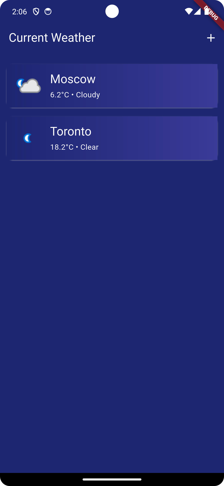
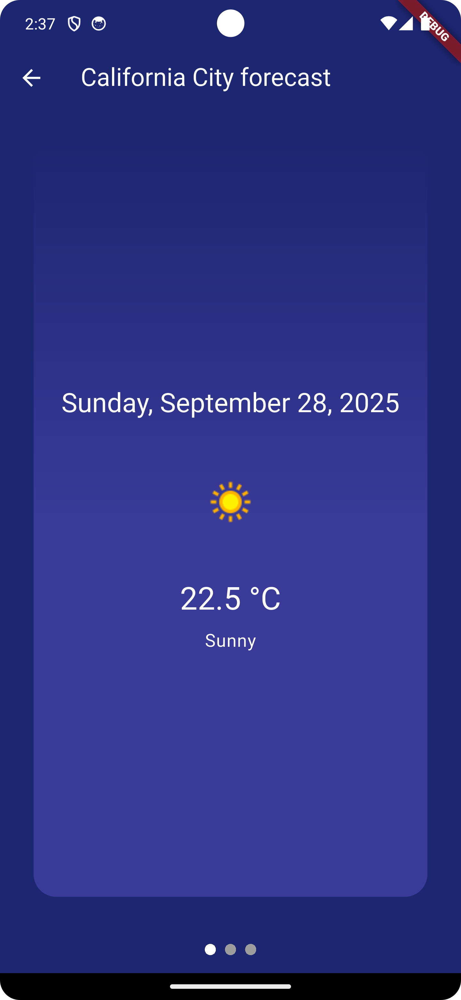

# Weather Forecast App

This is a simple weather forecast app that allows you to check the current weather and a 3-day forecast for any city.

## App Structure

The app is structured as follows:

- `lib/`
  - `src/`
    - `core/`: Contains the core components of the app, such as constants, exceptions, and widgets.
    - `data/`: Contains the data layer of the app, which includes models, repositories, and services.
    - `presentation/`: Contains the presentation layer of the app, which includes providers, screens, and widgets.
    - `utils/`: Contains utility functions.
  - `main.dart`: The entry point of the app.
  - `weather_app.dart`: The root widget of the app.

## How to Run

To run the app, you need to have Flutter installed. Then, follow these steps:

1.  Clone the repository.
2.  Create a `.env` file in the root of the project and add your API key from [weatherapi.com](https://www.weatherapi.com/) as `API_KEY` and the base URL as `BASE_URL` (e.g., `BASE_URL=https://api.weatherapi.com/v1`).
3.  Run `flutter pub get` to install the dependencies.
4.  Run `flutter run` to start the app.

## Features

- Search for any city to get the current weather and a 3-day forecast.
- Add cities to a list to quickly access their weather information.
- Remove cities from the list.

## Screenshots

| Screenshot 1 | Screenshot 2 |
| :---: | :---: |
|  |  |

## How to Build the Android App

To build the Android app, run the following command:

```
flutter build apk --release
```

This will create an APK file in the `build/app/outputs/flutter-apk/` directory.

## Download Internal Test Version

You can download the internal test version of the app from the following link:

[https://play.google.com/apps/internaltest/4701597767141562906](https://play.google.com/apps/internaltest/4701597767141562906)